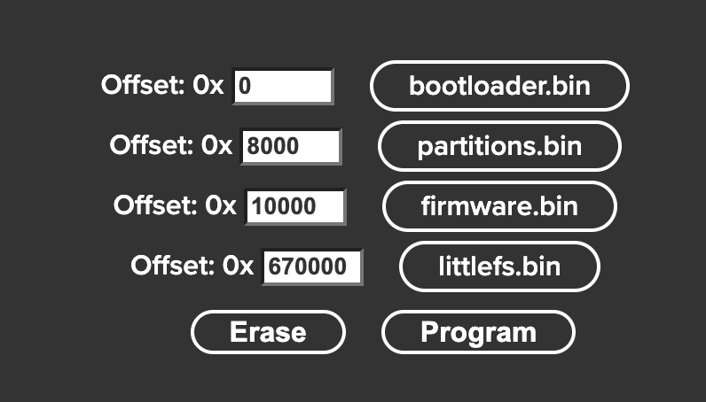

# Decent Open Scale (aka "openscale")
Decent Open Scale
Copyright 2024 Decent Espresso International Ltd

Credits:
Invention and authorship: Chen Zhichao (aka "Sofronio")

# Introduction:
The Decent Open Scale is a full open sourced(software/hardware/cad design) BLE scale. Currently you can use it with de1app and Decent Espresso machine. But with Decent Scale API, you can use it for anything.<br />
To make it work, you need at least an ESP32 for MCU, a Loadcell for weighing, an HX711 for Loadcell ADC, a SSD1306 for OLED display, a MPU6050 for gyro function.<br />
The current PCB for HDS uses ESP32S3N16, i2000 2kg loadcell, ADS1232(instead of HX711), SH1106/SH1116(instead of SSD1306), ADS1115(for battery voltage), TP4056(battery charging), CH340K(COM to USB), REF5025(analog VDD), BMA400(instead of MPU6050, but gyro will be dropped in the future).
If you want to use it unplugged, you'll also need a 3.7v battery.<br />
If you only want to burn the firmware, please read How to upload HEX file.<br />

# How to build

Beginning with firmware version 3.0.0, OpenScale now uses [Platform.io](https://platformio.org) for development, building and flashing the firmware.  

To build and flash the scale from your computer, make sure you have the `pio` command line tool installed.  
After this, one can simply use `$pio run -t upload` and platformio will build and flash the firmware to the connected Esp32s3 chip.


# New Features in 3.0.0

## Wifi mode

Decent Scale now uses WiFi for additional features, not just OTA update.   

To enable WiFi mode, go to HDS setup menu and find "Wifi settings" entry. From there you can enable/disable WiFi as well as see current WiFi details. If you toggle WiFi on/off, a restart of the scale is required for the new settings to take effect.
Initially HDS will open its own WiFi, called "Decent Scale", protected with a password '12345678'. Once connected to this WiFi, you can navigate with your browser to [hds.local](http://hds.local) or [192.168.1.1](http://192.168.1.1) to change the Wifi settings, in case you want HDS to connect to your home WiFi. 
Again, make sure to restart the scale for the settings to take effect.
If you store WiFi settings incorrectly, or you take your HDS out of signal range, HDS will return back to its own Wifi (Decent Scale) - so you can change the settings again if needed.

## Web apps
The same web apps that could be used with Half Decent Scale from [the web](https://decentespresso.com/docs/introducing_half_decent_scale_web_apps) have now been rewritten to run directly from the Half Decent Scale.

You can find these apps on the index page of Half Decent Scale Web User Interface - navigating to [hds.local](http://hds.local)

## WebSockets support

When WiFi mode is enabled on HDS, there is also a new WebSocket endpoint available, where you can receive real-time information regarding the weight in the following format  

```json
{
  "grams": 25.66,
  "ms": 12345
}
```

you can also send a simple `tare` String over the websocket and the scale will tare itself.


# How to upload Web apps?

In order to build and upload Web apps to HDS, you need to use `pio` to build and upload the filesystem image to the Esp32s3.  
Simply run `pio run -t buildfs -t uploadfs` with the Esp32s3 connected to your computer

# Automated builds

With version 3, we have also started using GitHub actions to build the firmware and filesystem images. You can find the recent builds on the "Actions" tab on the GitHub page of this project. From there you can also download the firmware files (e.g. for development builds).


# How to upload firmware files
Web USB Flash(please use Chrome/Edge, Safari or Firefox is not supported):<br />
https://adafruit.github.io/Adafruit_WebSerial_ESPTool/ <br />
The offset values are:<br />
bootloader.bin 0x0000<br />
partitions.bin 0x8000<br />
firmware.bin 0x10000<br />
littlefs.bin: 0x670000<br />




This tool works great, but need to reset by pressing the button on the PCB.<br />
And as it erase the eprom, a calibration is also required.<br />

Or use OpenJumper™ Serial Assistant, link as below.(In Chinese)<br />
https://www.cnblogs.com/wind-under-the-wing/p/14686625.html <br />
