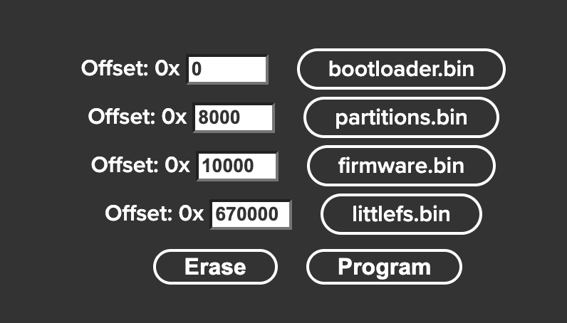

# Decent Open Scale (aka "openscale")
Decent Open Scale
Copyright 2024 Decent Espresso International Ltd

Credits:
Invention and authorship: Chen Zhichao (aka "Sofronio")

# Introduction:
The Decent Open Scale is a full open sourced(software/hardware/cad design) BLE scale. Currently you can use it with de1app and Decent Espresso machine. But with Decent Scale API, you can use it for anything.<br />
To make it work, you need at least an ESP32 for MCU, a Loadcell for weighing, an HX711 for Loadcell ADC, a SSD1306 for OLED display, a MPU6050 for gyro function.<br />
The current PCB for HDS uses ESP32S3N16, i2000 2kg loadcell, ADS1232(instead of HX711), SH1106/SH1116(instead of SSD1306), ADS1115(for battery voltage), TP4056(battery charging), CH340K(COM to USB), REF5025(analog VDD), BMA400(instead of MPU6050, but gyro will be dropped in the future).
If you want to use it unplugged, you'll also need a 3.7v battery.<br />
If you only want to burn the firmware, please read How to upload HEX file.<br />

# How to build

Beginning with firmware version 3.0.0, OpenScale now uses [Platform.io](https://platformio.org) for development, building and flashing the firmware.  

To build and flash the scale from your computer, make sure you have the `pio` command line tool installed.  
After this, one can simply use `$pio run -t upload` and platformio will build and flash the firmware to the connected Esp32s3 chip.


# New Features in 3.0.0

## Wifi mode

Decent Scale now uses WiFi for additional features, not just OTA update.   

To enable WiFi mode, go to HDS setup menu and find "Wifi settings" entry. From there you can enable/disable WiFi as well as see current WiFi details. If you toggle WiFi on/off, a restart of the scale is required for the new settings to take effect.
Initially HDS will open its own WiFi, called "Decent Scale", protected with a password '12345678'. Once connected to this WiFi, you can navigate with your browser to [hds.local](http://hds.local) or [192.168.1.1](http://192.168.1.1) to change the Wifi settings, in case you want HDS to connect to your home WiFi. 
Again, make sure to restart the scale for the settings to take effect.
If you store WiFi settings incorrectly, or you take your HDS out of signal range, HDS will return back to its own Wifi (Decent Scale) - so you can change the settings again if needed.

## Web apps
The same web apps that could be used with Half Decent Scale from [the web](https://decentespresso.com/docs/introducing_half_decent_scale_web_apps) have now been rewritten to run directly from the Half Decent Scale.

You can find these apps on the index page of Half Decent Scale Web User Interface - navigating to [hds.local](http://hds.local)

## WebSockets support

When WiFi mode is enabled on HDS, there is also a new WebSocket endpoint available, where you can receive real-time information regarding the weight in the following format  

```json
{
  "grams": 25.66,
  "ms": 12345
}
```

you can also send a simple `tare` String over the websocket and the scale will tare itself.

For backwards compatibility, snapshot frames do not include a `type` field.
Clients should treat the absence of `type` as a weight snapshot. Event and
response frames always include `type`.

> **Security / trust model:** the WebSocket endpoint is unauthenticated, just
> like the BLE interface. Any host that can reach the scale on the network can
> read weight and send control commands, including destructive ones such as
> `power off`, `soft_sleep on`, and `display off` (a remote `power off` cannot
> be woken over the network). Only expose HDS on a trusted LAN.

Multiple clients may connect at once (e.g. the on-device web UI and a separate
app). They share a single negotiated stream rate (the most recent `rate` command
applies to all clients); each client is served independently, so a backed-up
client drops its own frames without stalling the others.

By default, WiFi clients receive weight snapshots at 2 Hz. A connected client
can negotiate one of the supported WiFi stream rates by sending one of these
WebSocket messages:

```text
rate 2k
rate 5k
rate 10k
```

or JSON (any of these forms work):

```json
{ "command": "rate", "value": "10k" }
{ "rate": "10k" }
{ "rate_hz": 10 }
{ "hz": 10 }
{ "interval_ms": 100 }
```

The supported rates are 2 Hz, 5 Hz, and 10 Hz. The firmware sends back a
`type: "rate"` acknowledgement with the active interval and rate. The firmware
does not automatically downgrade a requested rate on weak WiFi; if a client's
socket is not writable for a tick, that frame is skipped for that client rather
than queued.

WiFi snapshots are intentionally kept small, especially at 10 Hz:

```json
{
  "grams": 25.66,
  "ms": 12345
}
```

Battery, charging, timer, and power/display state are sent in typed `status`
frames instead of every snapshot. `status`, `battery`, and `info` return a
status frame immediately. After `events on`, the firmware also sends a periodic
`type: "status"` frame every 5 seconds.

WiFi clients can send these text commands over the same WebSocket:

```text
tare
events on
events off
timer start
timer stop
timer reset
display on
display off
low_power on
low_power off
soft_sleep on
soft_sleep off
power off
status
battery
info
```

The legacy text `tare` command is intentionally silent for backwards
compatibility. JSON `{ "command": "tare" }` returns a `type: "status"` ack.

The same commands can be sent as JSON:

```json
{ "command": "tare" }
{ "command": "timer", "action": "start" }
```

An unrecognized or malformed command (bad JSON, or an unknown verb) returns an
`error` frame rather than silence, so a client can distinguish a rejected
command from a frame that never arrived:

```json
{
  "type": "error",
  "code": "unknown_command",
  "message": "unrecognized or malformed command",
  "ms": 12345
}
```

Status frame shape:

```json
{
  "type": "status",
  "status": "ok",
  "protocol_version": 1,
  "firmware_version": "FW: 3.0.9",
  "grams": 25.66,
  "ms": 12345,
  "battery_percent": 82,
  "battery_voltage": 3.95,
  "charging": false,
  "timer_running": true,
  "timer_seconds": 12,
  "display_on": true,
  "low_power": false,
  "soft_sleep": false,
  "events_enabled": true,
  "rate_hz": 10,
  "interval_ms": 100
}
```

For backwards compatibility, WiFi only sends weight snapshots by default. A
client must send `events on` before periodic status, local scale button presses,
or power-off notifications are emitted. The event stream resets to off when the
WebSocket disconnects.

Button event fields:

```json
{
  "type": "button",
  "button": "circle",
  "button_number": 1,
  "press": "short",
  "press_code": 1,
  "ms": 12345
}
```

Button numbers are `1 = circle` and `2 = square`. Press codes currently emitted
over WiFi are `1 = short` and `2 = long`; the current finger-detection path only
emits short-press events.

Power event fields:

```json
{
  "type": "power",
  "event": "power_off",
  "reason": "low_battery",
  "reason_code": 3,
  "ms": 12345
}
```

Power reason codes are `0 = disabled/failed`, `1 = circle double-click`,
`2 = square double-click`, `3 = low battery`, and `4 = gyro` when gyro support
is compiled in.

Power and display command semantics:

- `display on` / `display off`: OLED power save on/off. The scale and WiFi stay
  awake.
- `low_power on` / `low_power off`: sets OLED contrast to minimum/maximum. It
  does not disable the WiFi modem or drop the WebSocket link.
- `soft_sleep on`: turns off the OLED and sensor power rails and pauses normal
  scale-loop work. WiFi remains configured so a later WebSocket command can wake
  it, but weight snapshots stop while soft sleep is active.
- `soft_sleep off` / `soft_sleep wake`: restores sensor power, OLED power, and
  normal scale-loop work.
- `power off`: full scale power-off. The WebSocket link will drop and cannot
  wake the scale.


# How to upload Web apps?

In order to build and upload Web apps to HDS, you need to use `pio` to build and upload the filesystem image to the Esp32s3.  
Simply run `pio run -t buildfs -t uploadfs` with the Esp32s3 connected to your computer

# Development workflow

Trunk-based: `main` is the single long-lived branch and is always releasable. Do work on short-lived feature branches and merge into `main` once CI passes.

Releases: tag a known-good commit on `main` with the version (`vX.Y.Z`), then run the "Release firmware" workflow with that tag.

# Automated builds

With version 3, we have also started using GitHub actions to build the firmware and filesystem images. You can find the recent builds on the "Actions" tab on the GitHub page of this project. From there you can also download the firmware files (e.g. for development builds).


# How to upload firmware files
Web USB Flash(please use Chrome/Edge, Safari or Firefox is not supported):<br />
https://adafruit.github.io/Adafruit_WebSerial_ESPTool/ <br />
The offset values are:<br />
bootloader.bin 0x0000<br />
partitions.bin 0x8000<br />
firmware.bin 0x10000<br />
littlefs.bin: 0x670000<br />




This tool works great, but need to reset by pressing the button on the PCB.<br />
And as it erase the eprom, a calibration is also required.<br />

Or use OpenJumper™ Serial Assistant, link as below.(In Chinese)<br />
https://www.cnblogs.com/wind-under-the-wing/p/14686625.html <br />
